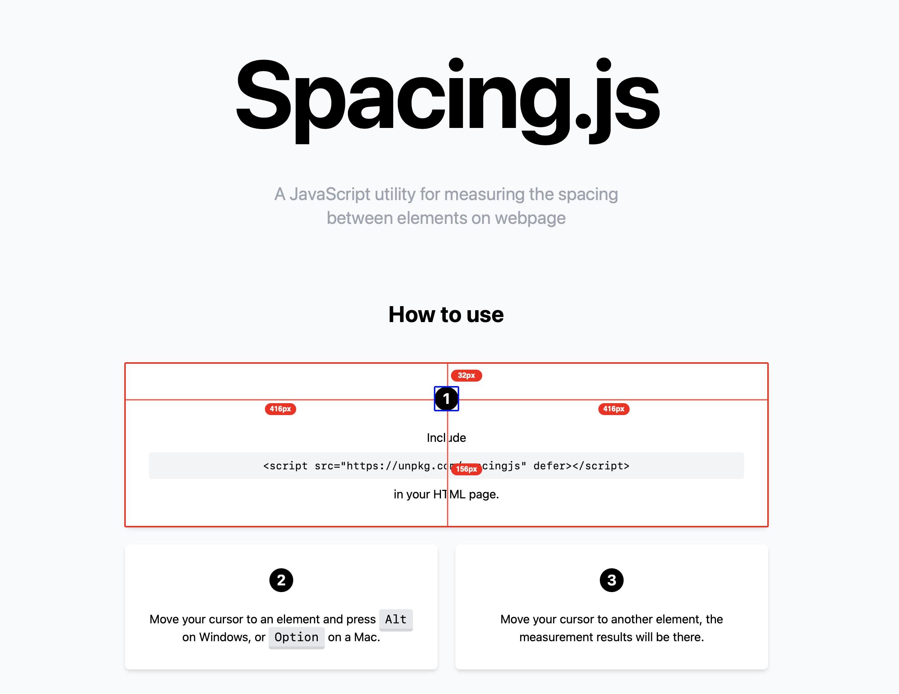

# Spacing JS

[](https://www.npmjs.com/package/@stevenlei/spacingjs)


一個用於測量網頁元素間距離的 JavaScript 小工具，用於前端開發的流程。[試試看](https://spacingjs.com)。



閱讀此文檔的其他語言版本：[English](README.md), [繁體中文](README.zh-Hant.md), [简体中文](README.zh-Hans.md).

## 如何使用

1. 在 HTML 頁面中透過 `<script>` 標籤加載 Spacing.js：

```html
<script src="//unpkg.com/spacingjs" defer></script>
```

2. 將遊標移動在一個元素上，然後按下 <kbd>Alt</kbd> 鍵（Windows）或 <kbd>⌥ Option</kbd> 鍵（Mac）。

3. 將遊標移動到其他元素上，即會顯示相關的測量結果。

## 參與開發

歡迎 Fork 這個 Repo 進行開發，並提交 Pull Requests。在 [GitHub Issues](https://github.com/stevenlei/spacingjs/issues) 回報 Bug，在 [GitHub Discussions](https://github.com/stevenlei/spacingjs/discussions) 討論功能／想法／問題。

## 授權協議

Spacing.js 使用 [MIT 授權](LICENSE)